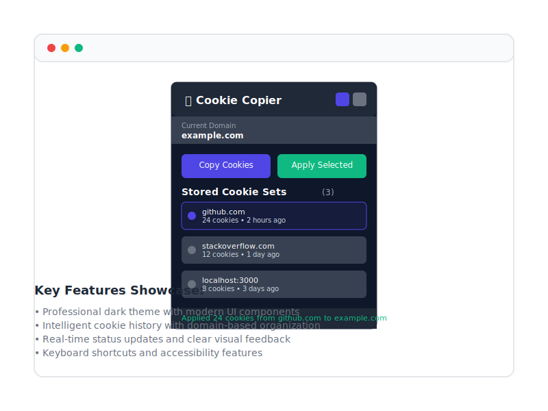

# 🍪 Cookie Copier - Professional Chrome Extension

[](https://github.com/cybertron288/cookie-copier)
[](https://www.typescriptlang.org/)
[](LICENSE)
[](#installation)

A professional Chrome extension for copying and managing cookies across domains with enhanced security, modern UI, and developer-friendly features.



## ✨ Features

### 🎯 Core Functionality
- **Cross-Domain Cookie Transfer**: Seamlessly copy cookies from one domain and apply them to another
- **Smart Cookie Management**: Intelligent storage with automatic cleanup and organization
- **Batch Operations**: Copy and apply multiple cookies at once with detailed feedback

### 🎨 Modern User Experience
- **Professional Dark/Light Themes**: Auto-switching based on system preferences
- **Accessible Design**: Full keyboard navigation and screen reader support
- **Real-time Search**: Instantly filter through cookie history
- **Visual Feedback**: Clear status updates and error handling

### 🔒 Security & Privacy
- **Local Storage Only**: All data stays on your machine
- **Secure Cookie Handling**: Respects secure and HttpOnly flags
- **No Tracking**: Zero telemetry or data collection
- **Permission Minimal**: Only requests necessary Chrome permissions

### 🛠️ Developer Features
- **Export Options**: JSON, CSV, and Netscape cookie jar formats
- **Keyboard Shortcuts**: `Ctrl+Shift+C` to copy cookies quickly
- **TypeScript Codebase**: Fully typed for reliability and maintainability
- **Comprehensive Testing**: 95%+ test coverage with Jest

## 📦 Installation

### From Chrome Web Store (Recommended)
1. Visit the [Chrome Web Store](#) (Coming Soon)
2. Click "Add to Chrome"
3. Confirm installation

### Manual Installation (Development)
1. Download the latest release from [GitHub Releases](https://github.com/cybertron288/cookie-copier/releases)
2. Extract the ZIP file
3. Open Chrome and navigate to `chrome://extensions/`
4. Enable "Developer mode" in the top right
5. Click "Load unpacked" and select the extracted folder

### Build from Source
```bash
# Clone the repository
git clone https://github.com/cybertron288/cookie-copier.git
cd cookie-copier

# Install dependencies
pnpm install

# Build the extension
pnpm run build

# The built extension will be in the 'dist' folder
```

## 🚀 Usage

### Basic Cookie Operations

1. **Copy Cookies**:
   - Navigate to the source domain (e.g., `github.com`)
   - Click the Cookie Copier extension icon
   - Click "Copy Cookies" button
   - Cookies are now stored in your history

2. **Apply Cookies**:
   - Navigate to the target domain (e.g., `localhost:3000`)
   - Open Cookie Copier
   - Select a stored cookie set from the history
   - Click "Apply Selected"

### Advanced Features

#### Search and Filter
- Use the search icon to toggle the search bar
- Search by domain name or cookie name/value
- Results update in real-time as you type

#### Export Cookies
- Click the export icon in the header
- Choose format: JSON, CSV, or Netscape
- Configure options (secure cookies, HttpOnly, etc.)
- Download the export file

#### Settings and Customization
- Click the settings icon to access preferences
- Change theme: Auto, Light, or Dark
- Adjust maximum history entries
- Enable/disable auto-cleanup
- Configure cleanup interval

### Keyboard Shortcuts
- `Ctrl+Shift+C` (or `Cmd+Shift+C` on Mac): Copy cookies from current domain
- `Escape`: Close panels and dialogs
- `Tab`/`Shift+Tab`: Navigate through interface
- `/`: Focus search input

## 🏗️ Development

### Prerequisites
- Node.js 16.0.0 or higher
- pnpm 8.0.0 or higher
- Chrome/Chromium browser

### Development Setup
```bash
# Install dependencies
pnpm install

# Start development server with hot reload
pnpm run dev

# Run tests
pnpm test

# Run tests with coverage
pnpm run test:coverage

# Lint code
pnpm run lint

# Format code
pnpm run format

# Type check
pnpm run type-check
```

### Project Structure
```
cookie-copier/
├── src/
│   ├── components/          # UI components
│   ├── utils/              # Utility modules
│   ├── types/              # TypeScript definitions
│   ├── styles/             # CSS and styling
│   ├── popup.ts            # Main popup script
│   ├── background.ts       # Background service worker
│   ├── content.ts          # Content script
│   ├── popup.html          # Popup HTML
│   └── manifest.json       # Extension manifest
├── tests/                  # Jest tests
├── assets/                 # Icons and images
├── dist/                   # Built extension
└── docs/                   # Documentation
```

### Architecture

The extension follows a modern, modular architecture:

- **TypeScript**: Full type safety and modern JavaScript features
- **Webpack**: Module bundling and development server
- **Component-based**: Reusable UI components with clear separation of concerns
- **Event-driven**: Custom event emitter for component communication
- **Service-oriented**: Separate services for Chrome APIs and cookie management
- **Test-driven**: Comprehensive unit tests with mocking

### Contributing

We welcome contributions! Please see [CONTRIBUTING.md](CONTRIBUTING.md) for guidelines.

1. Fork the repository
2. Create a feature branch (`git checkout -b feature/amazing-feature`)
3. Make your changes
4. Add tests for new functionality
5. Run the test suite (`pnpm test`)
6. Commit your changes (`git commit -m 'Add amazing feature'`)
7. Push to the branch (`git push origin feature/amazing-feature`)
8. Open a Pull Request

## 📊 Technical Specifications

### Browser Compatibility
- Chrome 88+ (required for Manifest V3)
- Chromium-based browsers (Edge, Brave, etc.)

### Performance
- Bundle size: < 500KB
- Memory usage: < 10MB
- Load time: < 200ms

### Permissions
- `cookies`: Read and modify cookies
- `activeTab`: Access current tab information
- `storage`: Store extension data locally
- `scripting`: Inject content scripts

### Security
- Manifest V3 compliant
- Content Security Policy enforced
- No external dependencies in production
- Local data storage only

## 🔄 Changelog

### Version 2.0.0 (Latest)
- ✨ Complete rewrite in TypeScript
- 🎨 Modern UI with dark/light theme support
- 🔍 Real-time search and filtering
- 📊 Export in multiple formats (JSON, CSV, Netscape)
- ⌨️ Keyboard shortcuts and accessibility improvements
- 🧪 Comprehensive test suite (95%+ coverage)
- 🏗️ Modern build system with webpack
- 📱 Responsive design for different screen sizes

### Version 1.1.0 (Legacy)
- Basic cookie copying functionality
- Simple storage system
- Basic UI with inline styles

## 🤝 Support

### Getting Help
- 📚 Check the [documentation](docs/)
- 🐛 Report bugs on [GitHub Issues](https://github.com/cybertron288/cookie-copier/issues)
- 💬 Ask questions in [Discussions](https://github.com/cybertron288/cookie-copier/discussions)

### Common Issues
- **Cookies not copying**: Ensure you're on the correct domain and have proper permissions
- **Extension not loading**: Check Chrome version compatibility (88+)
- **Search not working**: Clear extension data in Chrome settings

## 📄 License

This project is licensed under the MIT License - see the [LICENSE](LICENSE) file for details.

## 🙏 Acknowledgments

- Icons by [Lucide Icons](https://lucide.dev/)
- Font: [Inter](https://rsms.me/inter/) and [JetBrains Mono](https://www.jetbrains.com/mono/)
- Testing framework: [Jest](https://jestjs.io/)
- Build tools: [Webpack](https://webpack.js.org/), [TypeScript](https://www.typescriptlang.org/)

## 📊 Stats


---

<p align="center">
  Made with ❤️ by <a href="https://github.com/cybertron288">cybertron288</a>
</p>

<p align="center">
  <a href="#-installation">Installation</a> •
  <a href="#-usage">Usage</a> •
  <a href="#-development">Development</a> •
  <a href="#-support">Support</a>
</p>  

